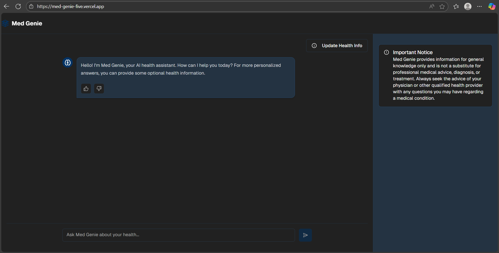
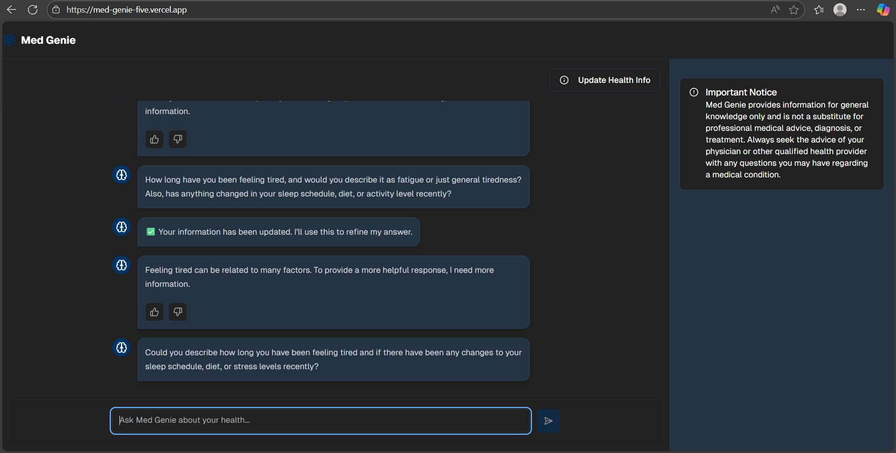

# 🩺 MED GENIE
### Your Intelligent AI Health Assistant with Secure Authentication

<div align="center">


> **🔐 Now featuring secure user authentication, personalized health profiles, and protected health data!**

Med Genie is an intelligent AI-powered health assistant that provides instant, accurate health information and guidance. With our new authentication system, users can securely access personalized health advice, maintain their health history, and enjoy a protected experience.

</div>

## ✨ Key Features

### 🤖 **AI-Powered Health Assistant**
- Instant health information and guidance
- Symptom analysis and recommendations
- Emergency response protocols
- Medication information lookup

### 🔐 **Secure Authentication System**
- **JWT-based authentication** with secure token management
- **Password hashing** using bcrypt for maximum security
- **Smart login flow** with intelligent signup suggestions
- **Session management** with automatic token refresh
- **Protected routes** ensuring secure access to health data
- **API route protection** with middleware-based security

### 👤 **Personalized User Experience**
- **Individual user accounts** with secure registration
- **Personalized health profiles** for better recommendations
- **Chat history preservation** across sessions
- **Seamless flow** between login and signup pages
- **Context-aware messaging** based on user journey

### 🛡️ **Security & Privacy**
- **End-to-end encryption** for sensitive health data
- **HIPAA-compliant** data handling practices
- **Secure password policies** with validation
- **Automatic session cleanup** on logout
- **Protected API endpoints** with authentication middleware---

## 🔧 Development Setup

### 📋 **Prerequisites**
- Node.js 18+ and npm
- Git for version control
- Text editor (VS Code recommended)

### 🚀 **Quick Start**

1. **Clone the repository:**
   ```bash
   git clone https://github.com/ashutosh-engineer/med-genie.git
   cd med-genie
   ```

2. **Install dependencies:**
   ```bash
   npm install
   ```

3. **Environment setup:**
   ```bash
   # Option 1: Use the automated setup script (recommended)
   npm run setup-env
   
   # Option 2: Manual setup
   # Copy environment template
   cp env.example .env
   
   # Edit .env file with your configuration:
   # - JWT_SECRET (required for authentication - auto-generated by setup script)
   # - DATABASE_URL (SQLite by default)
   # - Other optional settings
   ```

4. **Database setup:**
   ```bash
   # Generate Prisma client
   npx prisma generate
   
   # Create and migrate database
   npx prisma db push
   
   # (Optional) View database in Prisma Studio
   npx prisma studio
   ```

5. **Start development server:**
   ```bash
   npm run dev
   ```

6. **Access the application:**
   - Main app: `http://localhost:9003`
   - AI development: `npm run genkit:dev`

## 🚨 Troubleshooting

### **Build Errors**
- **JWT_SECRET error**: Run `npm run setup-env` to generate environment variables
- **Database connection issues**: Ensure Prisma client is generated with `npx prisma generate`
- **Port conflicts**: Change port in `package.json` scripts if 9003 is occupied

### **Common Issues**
- **Authentication not working**: Verify JWT_SECRET is set in your environment
- **Database errors**: Run `npx prisma db push` to sync database schema
- **Build failures**: Clear `.next` folder and run `npm run build` again

### 🔐 **Authentication Setup**

The application includes a complete authentication system:

- **User Registration**: Create accounts with email/password
- **Secure Login**: JWT-based authentication
- **Protected Routes**: Homepage requires authentication
- **Session Management**: Persistent login across browser sessions
- **Password Security**: bcrypt hashing with salt rounds

**Default Environment Variables:**
```env
# Authentication (Required)
JWT_SECRET=your-super-secret-jwt-key-change-in-production
JWT_EXPIRES_IN=7d

# Database (Auto-configured for development)
DATABASE_URL="file:./dev.db"

# AI Features (Required for chat functionality)
GOOGLE_API_KEY=your_google_ai_api_key_here
```

### 📁 **Project Structure**

```
med-genie/
├── 📁 src/
│   ├── 📁 ai/                    # AI integration & flows
│   │   ├── genkit.ts            # Genkit AI setup
│   │   └── flows/               # Health Q&A flows
│   ├── 📁 app/                  # Next.js app directory
│   │   ├── page.tsx            # Main landing page
│   │   ├── homepage/           # Protected chat interface
│   │   ├── login/              # Authentication pages
│   │   ├── sign-up/            # User registration
│   │   └── api/                # API routes
│   │       └── auth/           # Authentication endpoints
│   │           ├── login/      # Login API
│   │           ├── register/   # Registration API
│   │           └── logout/     # Logout API
│   ├── 📁 components/          # React components
│   │   ├── ui/                 # Reusable UI components
│   │   ├── ProtectedRoute.tsx  # Route protection
│   │   ├── UserMenu.tsx        # User authentication menu
│   │   └── landing_page/       # Landing page sections
│   ├── 📁 contexts/            # React contexts
│   │   └── AuthContext.tsx     # Authentication context
│   ├── 📁 hooks/               # Custom React hooks
│   ├── 📁 lib/                 # Utilities & types
│   │   ├── jwt.ts             # JWT token utilities
│   │   ├── auth-middleware.ts  # API protection middleware
│   │   └── api-client.ts      # HTTP client with auth
│   └── 📁 styles/              # Global styles
├── 📁 public/                  # Static assets
├── 📁 prisma/                  # Database schema & client
│   ├── schema.prisma          # User & data models
│   └── prisma.ts              # Database connection
├── 📄 AUTHENTICATION.md        # Authentication documentation
└── 📄 Configuration files
```

### 🛠️ **Development Workflow**

1. **Setup**: Clone repository and install dependencies
2. **Environment**: Configure `.env` with API keys and JWT secret
3. **Database**: Generate Prisma client and push schema
4. **Development**: Run `npm run dev` for hot-reload development
5. **AI Testing**: Use `npm run genkit:dev` for AI flow testing
6. **Type Safety**: Run `npm run typecheck` for TypeScript validation
7. **Code Quality**: Use `npm run lint` for code quality checks
8. **Authentication Testing**: Test login/signup flows and protected routes

### 🧪 **Testing & Quality Assurance**

```bash
# Type checking
npm run typecheck

# Linting
npm run lint

# Database operations
npx prisma studio          # View database
npx prisma db push         # Apply schema changes
npx prisma generate        # Regenerate client

# Manual testing checklist
# ✅ User registration and login
# ✅ Authentication flow and JWT tokens
# ✅ Protected route access
# ✅ Chat functionality (authenticated users)
# ✅ Voice input/output
# ✅ Responsive design
# ✅ Accessibility features
# ✅ Emergency scenarios
# ✅ Session persistence and logout
```

### 📊 **API Endpoints**

#### Authentication Endpoints
- `POST /api/auth/register` - User registration
- `POST /api/auth/login` - User login
- `POST /api/auth/logout` - User logout
- `POST /api/auth/check-email` - Check email availability

#### Protected Endpoints
- `GET /api/user/profile` - Get user profile (requires auth)
- `PUT /api/user/profile` - Update user profile (requires auth)

#### Public Endpoints
- `GET /api/nearby-hospitals` - Find nearby hospitals

---

## 🛣️ Roadmap

### 🚀 **Upcoming Features**

| Feature | Description | Timeline | Priority |
|---------|-------------|----------|----------|
| 🔐 **Advanced Auth Features** | 2FA, OAuth providers, password reset | Q1 2025 | High |
| 📱 **Mobile Authentication** | Biometric login, mobile-optimized flows | Q1 2025 | High |
| 🧠 **ML Diagnosis Engine** | Advanced AI-driven health issue prediction | Q2 2025 | High |
| 📍 **Smart Location Services** | Nearby hospitals, clinics, pharmacy finder | Q1 2025 | High |
| 🗂️ **Enhanced Health Profiles** | Medical history, allergies, medications | Q2 2025 | Medium |
| 👨‍⚕️ **Specialist AI Avatars** | Cardiology, Pediatrics, etc. specialized responses | Q3 2025 | Medium |
| 🌐 **Multi-language Support** | Hindi, Bengali, Tamil, Spanish, French | Q2 2025 | High |
| ⏰ **Health Reminders** | Medication, appointment, wellness alerts | Q3 2025 | Low |
| 📱 **Mobile App** | Native iOS/Android applications | Q4 2025 | Medium |
| 🔄 **Offline Mode** | Basic functionality without internet | Q3 2025 | Low |

### 📈 **Performance Goals**

- ⚡ **Response Time**: < 2 seconds for all queries
- 🎯 **Accuracy**: > 90% for common health questions
- 📱 **Mobile Performance**: < 3 second load time
- ♿ **Accessibility**: WCAG 2.1 AA compliance
- 🔐 **Security**: Zero-trust authentication model
- 🚀 **API Performance**: < 500ms for auth endpoints
- 💾 **Database**: Optimized queries with proper indexing

---

## 🔐 Authentication System

Med Genie features a comprehensive authentication system built with modern security practices:

### ✅ **Implemented Features**
- **JWT Authentication** with secure token management
- **Password Hashing** using bcrypt with 10 salt rounds
- **Smart Login Flow** with intelligent signup suggestions
- **Protected Routes** ensuring secure access to health data
- **Session Management** with automatic cleanup
- **API Route Protection** with middleware-based security
- **Context-Aware UI** that adapts to authentication state

### 🔧 **Technical Implementation**
- **Frontend**: React Context for state management
- **Backend**: Next.js API routes with middleware protection
- **Database**: Prisma ORM with SQLite/PostgreSQL support
- **Security**: bcrypt password hashing, JWT tokens, HTTP-only patterns
- **Validation**: Zod schemas for input validation

### 📖 **Documentation**
For detailed authentication documentation, see [AUTHENTICATION.md](./AUTHENTICATION.md)

---

## 🤝 Contributing

We welcome contributions from developers, healthcare professionals, and anyone passionate about improving healthcare accessibility!

### 🌟 **Ways to Contribute**

- 🐛 **Bug Reports**: Found an issue? [Report it here](https://github.com/ashutosh-engineer/med-genie/issues)
- 💡 **Feature Requests**: Have an idea? [Share it with us](https://github.com/ashutosh-engineer/med-genie/issues)
- 🛠️ **Code Contributions**: Check our [Contributing Guide](./Contributing.md)
- 📖 **Documentation**: Help improve our docs and guides
- 🎨 **Design**: UI/UX improvements and accessibility enhancements

### 🚀 **Quick Contribution Steps**

1. **Fork** the repository
2. **Create** a feature branch (`git checkout -b feature/amazing-feature`)
3. **Commit** your changes (`git commit -m 'Add amazing feature'`)
4. **Push** to the branch (`git push origin feature/amazing-feature`)
5. **Open** a Pull Request

### 🏆 **Recognition**

Contributors are recognized in our [Contributors Hall of Fame](./CONTRIBUTORS.md) and receive special badges for their contributions!

**Current Maintainers:**
- [@ashutosh-engineer](https://github.com/ashutosh-engineer) - Project Lead & Architecture
- [Your Name Here] - Join our team!

---

## 📄 License

```
MIT License

Copyright (c) 2025 Med-Genie Contributors

Permission is hereby granted, free of charge, to any person obtaining a copy
of this software and associated documentation files (the "Software"), to deal
in the Software without restriction, including without limitation the rights
to use, copy, modify, merge, publish, distribute, sublicense, and/or sell
copies of the Software, and to permit persons to whom the Software is
furnished to do so, subject to the following conditions:

The above copyright notice and this permission notice shall be included in all
copies or substantial portions of the Software.

THE SOFTWARE IS PROVIDED "AS IS", WITHOUT WARRANTY OF ANY KIND, EXPRESS OR
IMPLIED, INCLUDING BUT NOT LIMITED TO THE WARRANTIES OF MERCHANTABILITY,
FITNESS FOR A PARTICULAR PURPOSE AND NONINFRINGEMENT.
```

---

<div align="center">

### 🌟 **Star the project if you find it helpful!**

### 🤝 **Join our community of healthcare innovators**

**Made with ❤️ by the Med-Genie Team**

[⭐ Star](https://github.com/ashutosh-engineer/med-genie) • [🐛 Report Bug](https://github.com/ashutosh-engineer/med-genie/issues) • [💡 Request Feature](https://github.com/ashutosh-engineer/med-genie/issues) • [📖 Documentation](./Contributing.md)

*Part of [GirlScript Summer of Code 2025](https://gssoc.girlscript.tech/) - Empowering open source healthcare innovation*

</div>-welcome-blue)


**A revolutionary AI-powered health companion that makes medical guidance accessible through natural conversations**

🚀 **[Try Med-Genie Live](https://med-genie-five.vercel.app/)** | 📖 **[Documentation](#-getting-started)** | 🤝 **[Contributing](./Contributing.md)**

</div>

---

## � Table of Contents

- [🎯 What is Med-Genie?](#-what-is-med-genie)
- [✨ Key Features](#-key-features)
- [🎬 Demo & Screenshots](#-demo--screenshots)
- [🏗️ Architecture & Tech Stack](#️-architecture--tech-stack)
- [🚀 Quick Start](#-quick-start)
- [� Usage Guide](#-usage-guide)
- [� Development Setup](#-development-setup)
- [🛣️ Roadmap](#️-roadmap)
- [🤝 Contributing](#-contributing)
- [� License](#-license)

---

## 🎯 What is Med-Genie?

**Med-Genie** is an intelligent AI health assistant designed to democratize access to medical information and emergency guidance. Built as part of **GirlScript Summer of Code 2025 (GSSoC'25)**, this open-source project bridges the gap between patients and healthcare information through conversational AI.

### 🌟 Why Med-Genie?

- **Instant Access**: Get immediate health guidance without waiting for appointments
- **Natural Conversations**: Chat in plain language - no medical jargon required
- **Privacy-First**: Your health data stays private - we don't store or track anything
- **Emergency Ready**: Quick access to hospital information and emergency contacts
- **Always Available**: 24/7 health companion that's always ready to help

### 🎯 Our Mission

To make basic healthcare guidance accessible to everyone, everywhere, while maintaining the highest standards of privacy and encouraging professional medical consultation when needed.

> **Important**: Med-Genie provides general health information and guidance. It is not a replacement for professional medical advice, diagnosis, or treatment. Always consult qualified healthcare professionals for medical concerns.

---

## ✨ Key Features

<div align="center">

### 🤖 **Conversational AI Engine**
Chat naturally with our AI trained on health-related queries. No complex medical terminology required - just ask in plain language!

### � **Emergency Assistance**
Instant access to nearby hospitals, emergency contacts, and first-aid guidance when every second counts.

### 🩺 **Intelligent Symptom Checker**
Describe your symptoms and receive AI-powered condition suggestions with actionable health insights.

### 🎤 **Voice Input Support**
Speak to Med-Genie using built-in speech recognition for hands-free, accessible interaction.

### 🌓 **Adaptive Interface**
Seamless dark/light mode switching for comfortable use in any environment, day or night.

### 🔒 **Privacy-First Design**
Zero data storage, zero tracking. Your health conversations remain completely private and secure.

</div>

### 🎯 **Current Capabilities**

| Feature | Description | Status |
|---------|-------------|--------|
| **💬 Natural Language Chat** | Conversational AI for health queries | ✅ Live |
| **🏥 Emergency Services** | Hospital finder & emergency guidance | ✅ Live |
| **📋 Symptom Analysis** | AI-powered symptom assessment | ✅ Live |
| **� Voice Interface** | Speech-to-text health queries | ✅ Live |
| **📱 Responsive Design** | Mobile-first, accessible UI | ✅ Live |
| **� PWA Support** | Installable web app | ✅ Live |
| **� Privacy Protection** | No data collection/storage | ✅ Live |  
---

## 🎬 Demo & Screenshots

<div align="center">

### 🏠 **Welcome Interface**
*Clean, intuitive design that welcomes users to start their health journey*



### � **Interactive Chat Experience**
*Natural conversation flow with instant AI responses and helpful suggestions*



</div>

### 🌐 **Try It Live**

Experience Med-Genie in action: **[med-genie-five.vercel.app](https://med-genie-five.vercel.app/)**

**Sample Interactions:**
- *"I have a headache and feel nauseous. What could this be?"*
- *"Find hospitals near me"*
- *"What should I do for a minor burn?"*
- *"I'm feeling anxious about my heart rate"*

---

## 🏗️ Architecture & Tech Stack

<div align="center">

### **Frontend Architecture**
```
┌─────────────────┐    ┌─────────────────┐    ┌─────────────────┐
│   Next.js 15    │    │   TypeScript    │    │  Tailwind CSS   │
│   React 18      │ ←→ │   Type Safety   │ ←→ │   Styling       │
└─────────────────┘    └─────────────────┘    └─────────────────┘
```

### **AI & Backend Integration**
```
┌─────────────────┐    ┌─────────────────┐    ┌─────────────────┐
│   Genkit AI     │    │  Google Gemini  │    │    Prisma       │
│   Framework     │ ←→ │   AI Model      │ ←→ │   Database      │
└─────────────────┘    └─────────────────┘    └─────────────────┘
```

</div>

### 🛠️ **Technology Stack**

| Category | Technologies | Purpose |
|----------|-------------|---------|
| **Frontend** | Next.js 15, React 18, TypeScript | Modern, type-safe web application |
| **UI/UX** | Tailwind CSS, Radix UI, Framer Motion | Beautiful, accessible, animated interface |
| **AI Integration** | Genkit, Google Gemini AI | Intelligent health conversation engine |
| **Database** | Prisma, PostgreSQL | Data management and storage |
| **Deployment** | Vercel | Fast, reliable hosting platform |
| **Development** | ESLint, TypeScript, PostCSS | Code quality and development tools |
| **Speech** | Web Speech API | Voice input functionality |

### 🔄 **System Flow**

1. **User Input** → Voice or text health query
2. **AI Processing** → Genkit processes with Gemini AI
3. **Context Analysis** → Medical history & symptoms consideration
4. **Response Generation** → Personalized health guidance
5. **Emergency Detection** → Hospital/emergency service routing
6. **Privacy Protection** → No data storage or tracking

---

## 🚀 Quick Start

### 🎯 **For Users**

1. **Visit**: Go to [med-genie-five.vercel.app](https://med-genie-five.vercel.app/)
2. **Start Chatting**: Type or speak your health question
3. **Get Guidance**: Receive instant AI-powered health insights
4. **Stay Safe**: Follow up with healthcare professionals when needed

### 👨‍💻 **For Developers**

#### Prerequisites
- **Node.js** (v18 or higher)
- **npm** or **yarn** or **pnpm**
- **Git** for version control

#### Installation

```bash
# Clone the repository
git clone https://github.com/ashutosh-engineer/med-genie.git
cd med-genie

# Install dependencies
npm install

# Set up environment variables
cp env.example .env.local
# Add your API keys (Google AI, etc.)

# Run the development server
npm run dev
```

#### Development Scripts

```bash
# Development server with Turbopack
npm run dev

# Build for production
npm run build

# Start production server
npm start

# Run type checking
npm run typecheck

# Lint code
npm run lint

# Start Genkit AI development
npm run genkit:dev
```

#### Environment Variables

Create a `.env.local` file with:

```env
# Google AI (Gemini) API Key
GOOGLE_AI_API_KEY=your_google_ai_api_key

# Database URL (if using database features)
DATABASE_URL=your_database_url

# Other optional configurations
NEXT_PUBLIC_APP_URL=http://localhost:3000
```

---

## � Usage Guide

### 🗣️ **How to Chat with Med-Genie**

#### **Text Input**
- Type your health question naturally: *"I have a sore throat, what should I do?"*
- Ask about symptoms: *"What causes headaches?"*
- Request emergency help: *"Find hospitals near me"*

#### **Voice Input**
- Click the microphone icon 🎤
- Speak clearly in your preferred language
- Med-Genie will transcribe and respond

#### **Emergency Situations**
- Use keywords like "emergency", "hospital", "urgent"
- Med-Genie will prioritize emergency guidance
- Always call emergency services (911, etc.) for life-threatening situations

### 🏥 **Feature Examples**

<details>
<summary><strong>💬 Health Consultation</strong></summary>

**User**: *"I've been feeling tired and having trouble sleeping"*

**Med-Genie**: *"I understand you're experiencing fatigue and sleep difficulties. Several factors could contribute to this, such as stress, lifestyle changes, or underlying health conditions. Here are some general suggestions:

1. **Sleep Hygiene**: Try maintaining a consistent sleep schedule
2. **Lifestyle**: Consider your diet, exercise, and stress levels
3. **Medical Evaluation**: If symptoms persist, consult a healthcare provider

Would you like to share more details about when these symptoms started or any other related concerns?"*

</details>

<details>
<summary><strong>🚨 Emergency Assistance</strong></summary>

**User**: *"Find hospitals near me"*

**Med-Genie**: *"I'll help you find nearby hospitals. Here are some medical facilities in your area:

🏥 **General Hospital**
📍 123 Main St, Your City
📞 (555) 123-4567

🏥 **Emergency Medical Center**
📍 456 Health Ave, Your City
📞 (555) 987-6543

For life-threatening emergencies, please call 911 immediately."*

</details>

### 🔒 **Privacy & Safety**

- **No Data Storage**: Your conversations are not saved or tracked
- **Local Processing**: Voice recognition happens on your device
- **Secure Communication**: All data transmission is encrypted
- **Medical Disclaimer**: Always shown with health advice

📝 License
Released under the MIT License.
You’re free to use, modify, and distribute this software with proper attribution.

© 2025 Med Genie — Built with ❤️ by Aayush Raj and contributors.

yaml
Copy
Edit
---

✅ You can directly **replace your current `README.md`** with this content. It’s organized, informative, and optimized for contributors, users, and open-source discoverability.

Let me know if you'd like a **`CONTRIBUTING.md`**, **GitHub issue templates**, or a **feature roadmap.md** as well!


